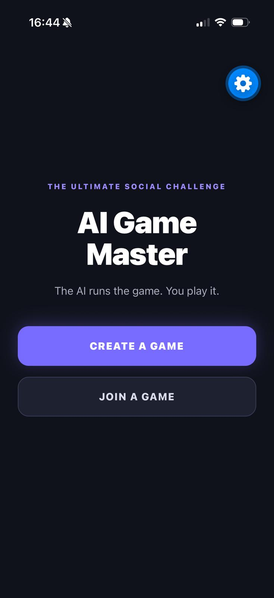
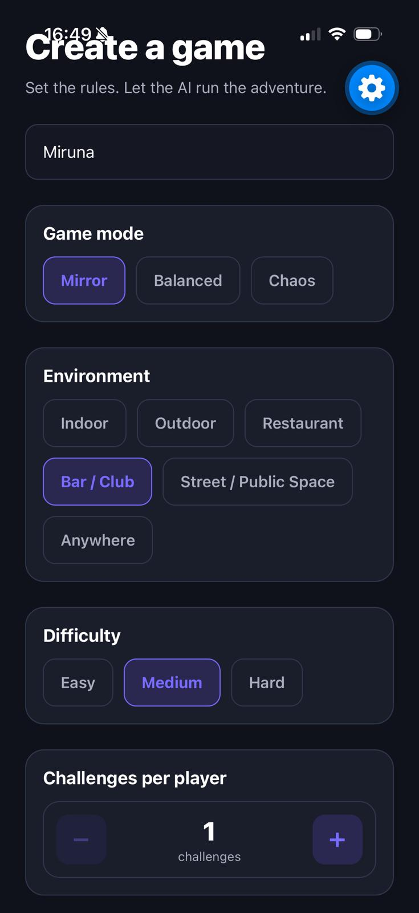
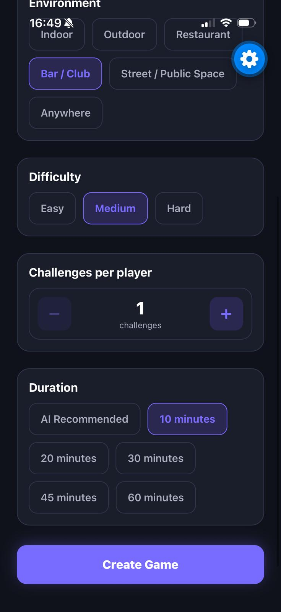
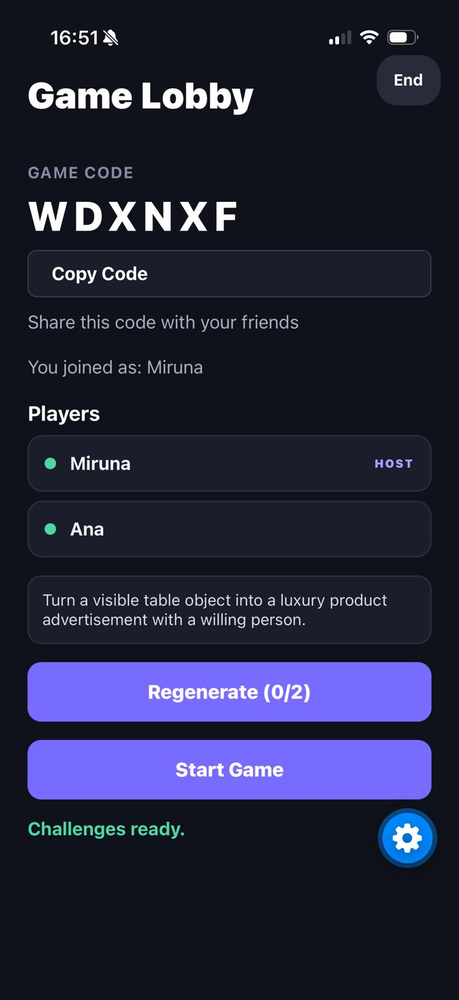
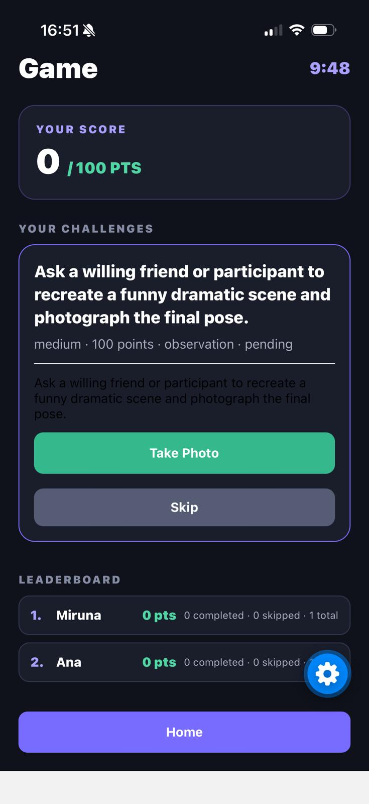
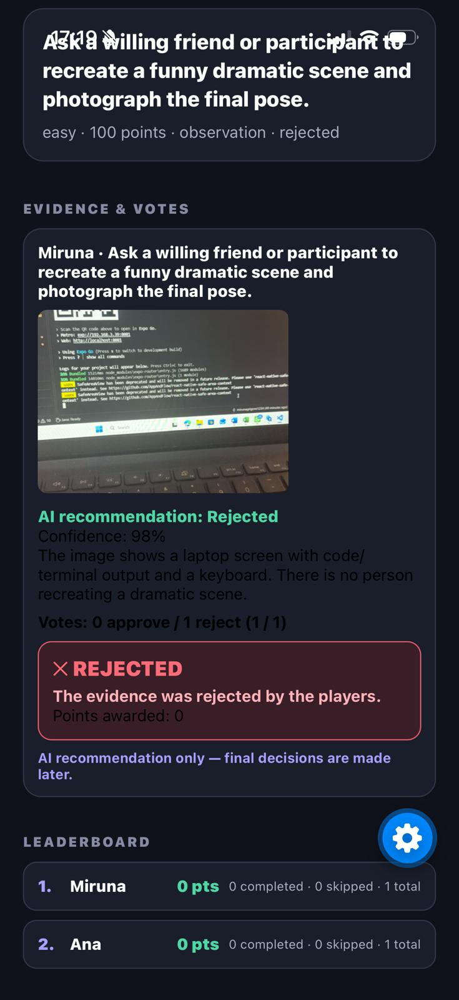
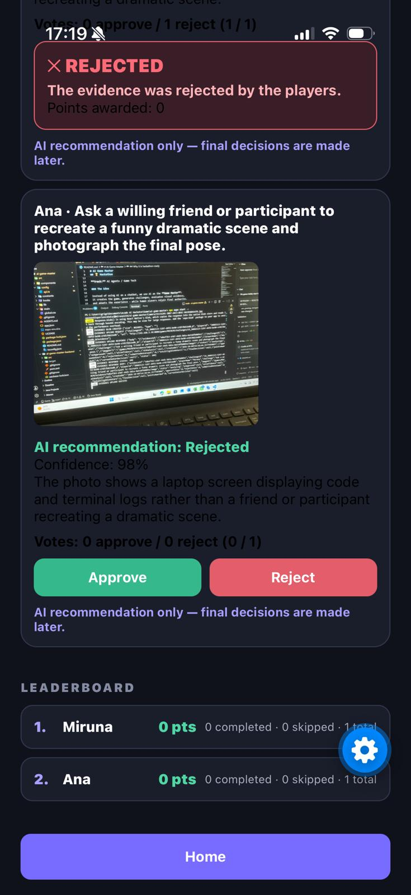
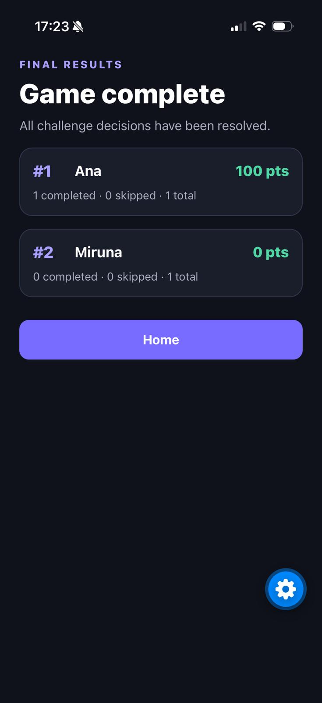

# AI Game Master

> **An autonomous AI Game Master for real-world multiplayer games.**

AI Game Master turns a group of players into a live game show. The host creates a room, the AI creates social challenges, players complete them in the real world, and photo evidence is reviewed by both Gemini Vision and the human players.

The **Expo mobile app** is the player experience. The **Spring Boot backend** is authoritative for game state, rules, scoring, timers, evidence, voting, and game completion.

## 🏆 Hackathon

Built for the **Cambridge × Arcade AI Hackathon 2026**

**Track:** AI Agents / Game Tech

### The idea

Instead of using AI as a chatbot, we use AI as the **Game Master**:
it creates the game, generates challenges, evaluates visual evidence,
and adapts the experience — while human players retain final authority.

## AI Game Master

The AI Game Master maintains an understanding of the current game state
and uses it to make game decisions.

It can:
- generate challenges based on the environment and game mode
- balance challenge difficulty and point values
- recommend game duration while allowing the host to accept or override the recommendation
- evaluate submitted evidence
- adapt future challenges based on player progress
- avoid repeating challenges already used
- operate within hard safety and feasibility constraints

## 🎮 See It In Action

### Create the game






### Build the multiplayer lobby



### Play AI-generated challenges



### AI-assisted evidence review



### Humans make the final decision



### Finish with the final leaderboard



## Architecture

```text
React Native / Expo mobile app
              |
              v
      Spring Boot REST API
              |
              v
 Game state + game rules + scoring
              |
              v
        Gemini AI services
```

The backend owns:

- game and player state
- challenge assignment and states
- scores and leaderboard
- server-side timer
- evidence records and temporary image storage
- voting and majority resolution
- automatic game completion

Gemini is **not** the final authority for evidence. Gemini Vision provides an approval recommendation, confidence, and analysis. Human players make the final approve/reject decision.

## Game modes

### Mirror

- Everyone receives the same challenges.
- Everyone receives the same point values.
- The host selects the difficulty.

### Balanced

- Players receive different challenges with equivalent difficulty.
- Each player has exactly 100 points distributed across their challenges.
- The host selects the difficulty.

### Chaos

- Challenge difficulty is selected unpredictably.
- Challenges are intentionally unpredictable.
- Each player can earn up to 100 points.
- There is no manual difficulty selector.

## Game flow

## Game flow

1. The host creates a game.
2. Players join with the six-character game code.
3. The host prepares challenges.
4. Each player sees only their own assigned challenges.
5. The host confirms the game duration, either by accepting the AI recommendation or choosing a manual duration.
6. The host starts the game.
7. Players attempt, skip, or submit evidence for challenges.
8. Players can save captured photos to their device while playing.
9. Evidence is captured with the in-app camera and uploaded to the backend.
10. Gemini Vision analyzes the image when available.
11. Other players vote to approve or reject the evidence.
12. Human majority determines the final result.
13. Approved evidence completes the challenge and awards its points.
14. Rejected, skipped, or incomplete challenges award 0 points.
15. Players see their live score throughout the game, starting at 0 and increasing as challenges are approved.
16. The game ends when the timer expires or every challenge is resolved.
17. The final leaderboard is shown in the game view.

## Challenge design and safety

Challenges are designed as social, real-world game-show prompts—not as a generic photo scavenger hunt. Generated and fallback challenges cover categories such as:

- social interaction
- roleplay
- creative actions
- collaboration
- performance
- observation
- negotiation
- transformation
- composition
- wild challenges

The backend safety filter rejects unsafe challenge text. Challenges are designed to avoid:

- dangerous or illegal activities
- forced participation
- unwanted touching
- non-consensual photography
- photographing private belongings
- requests for private information

## Scoring

- Each player has a maximum of 100 available points.
- Players start with a score of 0.
- Points are distributed according to challenge difficulty.
- Approved evidence awards the challenge’s points.
- Rejected, skipped, and incomplete challenges award 0 points.
- Scores never decrease.
- Points are awarded at most once per evidence decision.
- The current player score is displayed live during gameplay.

## Evidence and AI Vision

Each challenge supports one evidence submission:

1. The player captures one photo with the Expo camera.
2. The player can optionally save the captured photo to their device.
3. The mobile app uploads the image as multipart form data.
4. The backend stores a temporary image file and creates an evidence record.
5. The backend sends the image and exact challenge text to Gemini Vision.
6. Gemini returns structured recommendation data:
   - approval recommendation
   - confidence
   - short analysis
7. Human players vote on the evidence.

Saving a photo is independent from evidence submission. A player can keep a photo as a memory of the real-world game without affecting AI analysis, voting, scoring, or challenge completion.

Gemini does **not** directly award points, complete a challenge, or reject a challenge. Human voting is authoritative. AI analysis failure leaves evidence retryable and does not prevent human resolution.

When Gemini challenge generation is unavailable, the backend uses its safe local challenge pool immediately. This keeps Prepare Challenges fast and playable without requiring an AI response.

## Voting rules

- The evidence owner cannot vote on their own evidence.
- Other players in the game can vote.
- Each player can vote once per evidence item.
- Decisions are `approve` or `reject`.
- An early majority can resolve evidence.
- If all eligible votes are cast without an approval majority, the evidence is rejected on a tie.
- Finalized evidence cannot be voted on again.

## Timer and regeneration

### Timer

The timer is controlled by the server and supports:

- 10 minutes
- 20 minutes
- 30 minutes
- 45 minutes
- 60 minutes
- AI Recommended duration

When AI Recommended duration is selected, the host can accept the AI recommendation or choose a different duration manually. The AI recommendation does not automatically override the host's decision.

If AI duration recommendation is unavailable, the backend uses the existing local fallback.

### Regeneration

- Host-only action
- Available only before the game starts
- Limited to two regenerations
- Replaces the entire challenge set
- Tracks previously used challenge text and avoids reused ideas where practical

## REST API

All endpoints are rooted at `/games`.

### Game creation and joining

```text
POST /games
```

Create a lobby. The request includes `mode`, `environment`, `difficulty`, `challengeCount`, and `duration`.

```text
GET /games/{code}
```

Return the authoritative current `GameState`. Mobile clients poll this endpoint.

```text
POST /games/{code}/join
```

Join with:

```json
{ "name": "Player name" }
```

```text
GET /games/{code}/players
```

List players currently in the game.

```text
DELETE /games/{code}/players/{playerId}
```

Remove a non-host player from the lobby.

### Challenge preparation and game control

```text
POST /games/{code}/prepare-challenges
```

Host-only initial challenge preparation. Returns the updated `GameState`. If challenges already exist, the request is idempotent and returns the existing state.

Request:

```json
{ "playerId": "host-player-id" }
```

```text
POST /games/{code}/regenerate-challenges
```

Host-only challenge regeneration before the game starts. Uses the same `playerId` request body and is limited to two regenerations.

```text
GET /games/{code}/challenges?playerId={playerId}
```

Return only the challenges assigned to the requested player.

```text
POST /games/{code}/start
```

Start the game. Request:

```json
{
  "playerId": "host-player-id",
  "duration": "30"
}
```

```text
POST /games/{code}/end
```

Host-only end-game action. Request:

```json
{ "playerId": "host-player-id" }
```

### Challenge actions

```text
POST /games/{code}/challenges/{challengeId}/skip
```

Skip an owned pending challenge.

```text
POST /games/{code}/challenges/{challengeId}/complete
```

Backend completion support retained for the game lifecycle; evidence-backed completion is resolved through human voting.

Both challenge actions accept:

```json
{ "playerId": "player-id" }
```

### Evidence and images

```text
POST /games/{code}/challenges/{challengeId}/evidence
```

Submit one photo as multipart form data:

- `playerId`: player ID
- `image`: image file

```text
GET /games/{code}/evidence?playerId={playerId}
```

List evidence and the viewer’s voting state.

```text
POST /games/{code}/evidence/{evidenceId}/retry
```

Retry AI analysis for evidence owned by the requesting player.

Request:

```json
{ "playerId": "player-id" }
```

```text
GET /games/{code}/evidence/{evidenceId}/image
```

Retrieve the stored evidence image.

```text
POST /games/{code}/evidence/{evidenceId}/votes
```

Cast one human vote:

```json
{
  "evidenceId": "evidence-id",
  "playerId": "voter-id",
  "decision": "approve"
}
```

`decision` must be `approve` or `reject`.

### Leaderboard

```text
GET /games/{code}/leaderboard
```

Return scores and completed/skipped challenge counts for each player.

## Running locally

### Prerequisites

- Java 21
- Maven
- Node.js and npm
- Expo-compatible development environment
- A phone/emulator that can reach the backend over the local network for physical-device testing

### Backend

```bash
cd ai-game-master-backend
mvn spring-boot:run
```

The API runs on port `8080`.

Multipart evidence limits are configured to 10 MB:

```properties
spring.servlet.multipart.max-file-size=10MB
spring.servlet.multipart.max-request-size=10MB
```

Gemini Vision uses `GEMINI_API_KEY` on the backend. Do not put the key in the mobile app. Local challenge generation is the default path so the game remains usable when Gemini challenge-generation quota is unavailable.

### Mobile app

```bash
cd ai-game-master
npm install
npx expo start
```

For a physical phone, update [`src/config/api.ts`](./ai-game-master/src/config/api.ts) so `API_BASE_URL` points to the computer’s LAN IP address, then start Expo and open the project on the device.

The mobile app uses:

- Expo Router
- TypeScript
- `expo-camera`
- `expo-clipboard`
- React Native polling for live state synchronization

### Compile checks

Backend:

```bash
cd ai-game-master-backend
mvn clean compile
```

Frontend:

```bash
cd ai-game-master
npx tsc --noEmit
```

## Project layout

```text
.
├── ai-game-master/                 # Expo / React Native mobile app
│   └── src/app/
│       ├── create/                 # Create and configure a game
│       ├── join/                   # Join by game code
│       ├── lobby/                  # Lobby polling and host controls
│       └── game/                   # Challenges, camera, evidence, voting, leaderboard
└── ai-game-master-backend/         # Spring Boot REST API
    └── src/main/java/com/aigamemaster/
        ├── controller/             # REST endpoints
        ├── model/                  # Game, challenge, evidence, vote models
        └── service/                # Rules, AI integration, scoring, storage
```

## Current scope

Game state is stored in memory, so restarting the backend clears active games and temporary game state. The project currently uses REST polling rather than WebSockets and does not require a database, Firebase, or cloud storage.

## Future Improvements

The current version focuses on the core AI Game Master experience. Future iterations could extend the project with:

- **Game History** — allow players to revisit previous games, including leaderboards, challenges, results, and submitted evidence.
- **Photo Gallery** — provide a dedicated gallery where players can browse photos collected during their games.
- **Photo Downloads from History** — allow players to download or save evidence photos from completed games.
